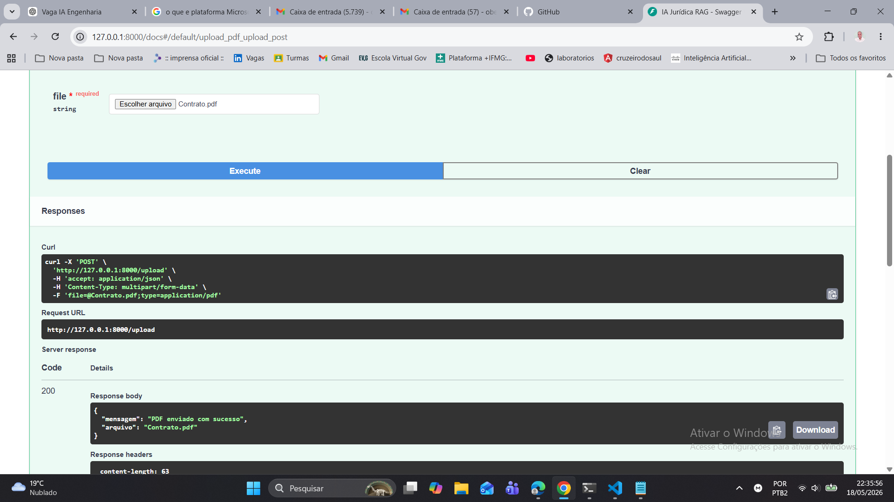
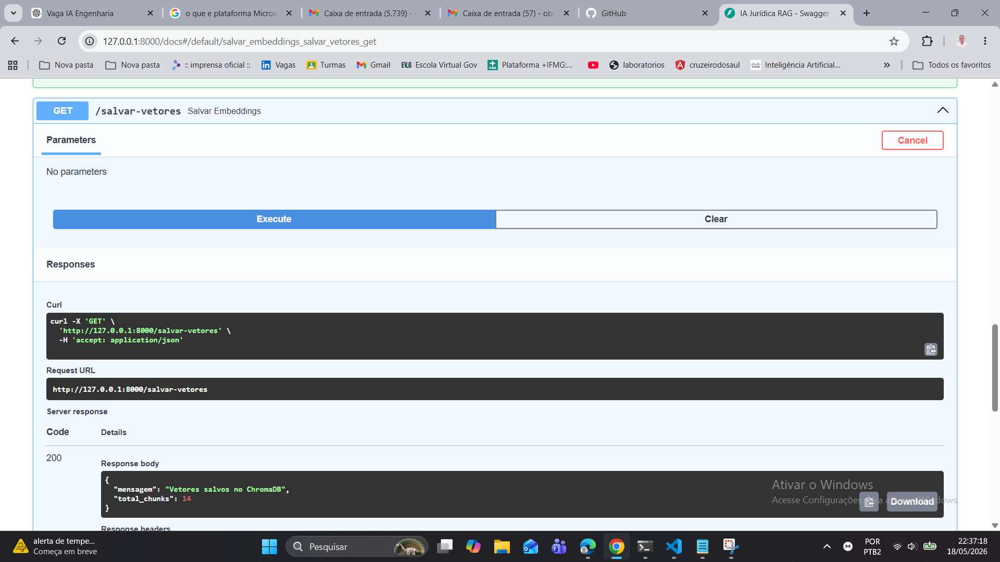
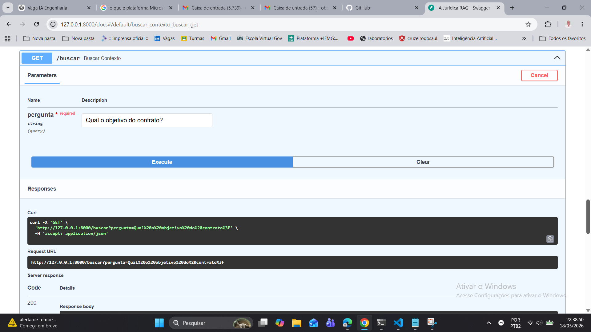

# Juridico AI - RAG para Analise de Contratos

API backend em Python para consulta inteligente de documentos juridicos usando RAG
(Retrieval-Augmented Generation), embeddings semanticos, ChromaDB e LLM.

O projeto permite enviar um contrato em PDF, transformar o conteudo em vetores,
buscar trechos relevantes por similaridade semantica e gerar uma resposta com
base no contexto recuperado.

## Demo

Fluxo demonstrado:

1. Upload de um contrato em PDF.
2. Extracao e divisao do texto em chunks.
3. Geracao de embeddings.
4. Persistencia dos vetores no ChromaDB.
5. Pergunta em linguagem natural.
6. Resposta da IA com trechos originais usados como contexto.

Exemplo de pergunta:

```text
Quais clausulas representam risco juridico?
```

## Por que este projeto e relevante

Este projeto demonstra competencias importantes para vagas de backend, IA e
automacao:

- Criacao de APIs REST com FastAPI.
- Arquitetura RAG aplicada a um problema real.
- Processamento de PDFs juridicos.
- Uso de embeddings e banco vetorial.
- Integracao com LLM via API externa.
- Separacao por camadas de rotas, servicos e configuracao.
- Retorno de contexto consultado para aumentar rastreabilidade da resposta.

## Arquitetura

```text
PDF
  -> Extracao de texto
  -> Chunking
  -> Embeddings
  -> ChromaDB
  -> Busca semantica
  -> Prompt com contexto
  -> Resposta da IA
```

## Stack

- Python
- FastAPI
- Uvicorn
- LangChain
- PyPDF
- Sentence Transformers
- ChromaDB
- Groq API

## Estrutura

```text
backend/
|-- app/
|   |-- config/
|   |   `-- settings.py
|   |-- routes/
|   |   |-- upload_routes.py
|   |   `-- rag_routes.py
|   `-- services/
|       |-- chunk_service.py
|       |-- chroma_service.py
|       |-- embedding_service.py
|       |-- llm_service.py
|       `-- pdf_service.py
|-- assets/
|-- main.py
|-- requirements.txt
|-- .env.example
`-- README.md
```

## Como executar

Clone o repositorio:

```bash
git clone https://github.com/obedevieirasantos/juridico-ai.git
cd juridico-ai/backend
```

Crie e ative um ambiente virtual:

```bash
python -m venv .venv
```

Windows:

```bash
.venv\Scripts\activate
```

Linux/macOS:

```bash
source .venv/bin/activate
```

Instale as dependencias:

```bash
pip install -r requirements.txt
```

Configure as variaveis de ambiente:

```bash
cp .env.example .env
```

Edite o arquivo `.env`:

```env
GROQ_API_KEY=sua_chave_da_groq
```

Execute a API:

```bash
uvicorn main:app --reload
```

Acesse a documentacao interativa:

```text
http://127.0.0.1:8000/docs
```

## Endpoints principais

### Health check

```http
GET /
```

### Upload de PDF

```http
POST /upload
```

Recebe um arquivo PDF e salva para processamento.

### Indexar documento

```http
POST /salvar-vetores
```

Extrai o texto do PDF, cria chunks, gera embeddings e salva os vetores no
ChromaDB.

### Buscar resposta

```http
POST /buscar
```

Exemplo de payload:

```json
{
  "pergunta": "Quais clausulas representam risco juridico?"
}
```

Exemplo de resposta:

```json
{
  "pergunta": "Quais clausulas representam risco juridico?",
  "resposta": "Com base no contexto fornecido...",
  "contexto": [
    "Trecho original recuperado do contrato..."
  ]
}
```

## Screenshots

### Upload de PDF



### Geracao de embeddings



### Busca semantica



## Melhorias planejadas

- Suporte a multiplos documentos.
- Classificacao automatica de risco juridico.
- Citacao de pagina e trecho de origem.
- OCR para PDFs escaneados.
- Autenticacao com JWT.
- Testes automatizados.
- Dockerfile e deploy em cloud.
- Interface web com historico de consultas.

## Autor

**Obede Vieira dos Santos**

Projeto desenvolvido para demonstrar aplicacao pratica de IA generativa,
arquitetura RAG, processamento de documentos e desenvolvimento de APIs com
Python.
