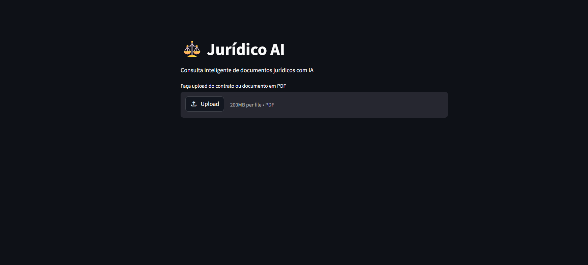
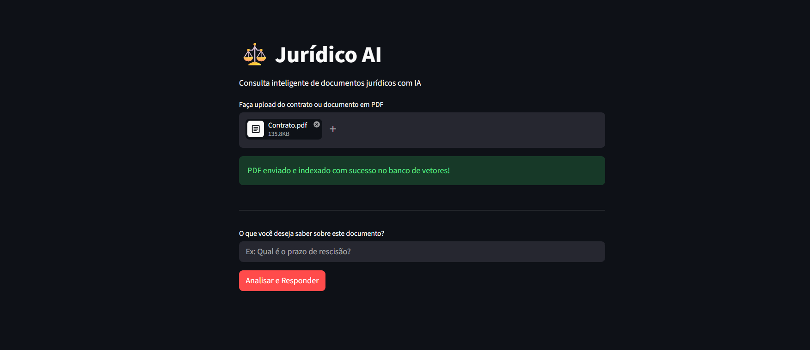
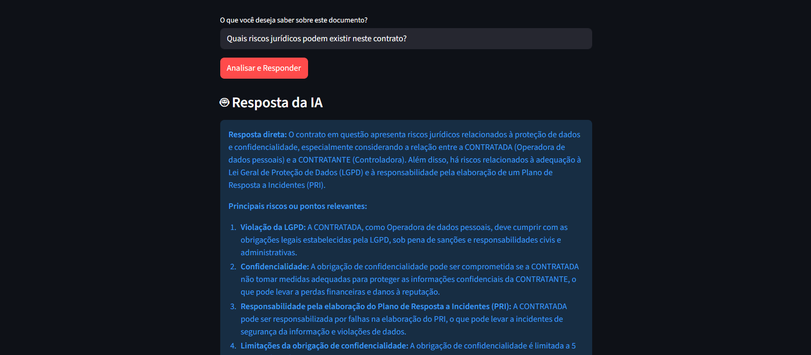
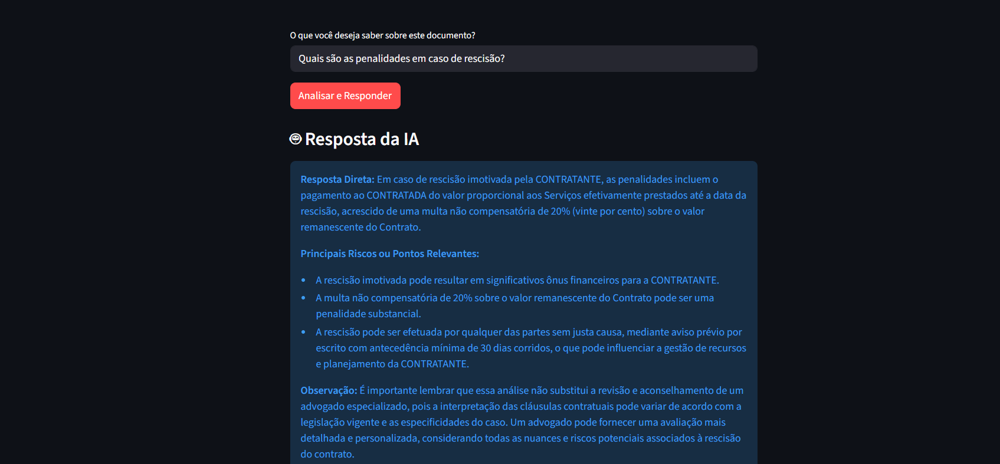
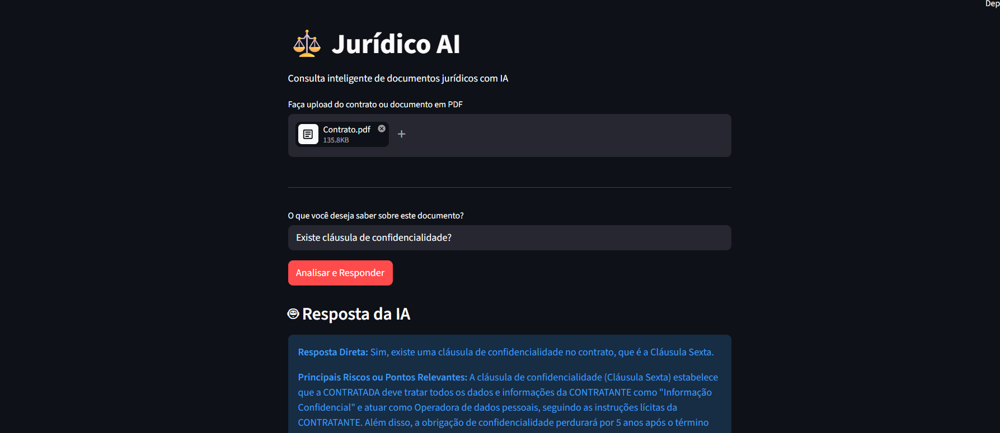

# ⚖️ Jurídico AI — RAG para Análise de Contratos

API backend em Python para consulta inteligente de documentos jurídicos usando RAG (Retrieval-Augmented Generation), embeddings semânticos, ChromaDB e LLM.

O projeto permite enviar um contrato em PDF, transformar o conteúdo em vetores, buscar trechos relevantes por similaridade semântica e gerar uma resposta com base no contexto recuperado.

---

## 🎬 Demo

[](https://youtu.be/n1vQPEw7I4M)

---

## 📸 Screenshots

### Tela Inicial


### Upload do Contrato


### Fazendo Perguntas




---

## 🚀 Fluxo do Sistema

```
PDF → Extração de texto → Chunking → Embeddings → ChromaDB
                                                       ↓
Resposta ← LLM (Groq) ← Contexto ← Busca semântica ←─┘
```

1. Upload de um contrato em PDF
2. Extração e divisão do texto em chunks
3. Geração de embeddings semânticos
4. Persistência dos vetores no ChromaDB
5. Pergunta em linguagem natural
6. Resposta da IA com trechos originais usados como contexto

---

## 🛠️ Stack

| Camada | Tecnologia |
|---|---|
| Backend | FastAPI + Uvicorn |
| Frontend | Streamlit |
| Embeddings | sentence-transformers (all-MiniLM-L6-v2) |
| Banco vetorial | ChromaDB |
| LLM | Groq (llama3-70b-8192) |
| Leitura PDF | PyPDF + LangChain |

---

## ⚙️ Como rodar

### 1. Clone o repositório
```bash
git clone https://github.com/obedevieirasantos/juridico-ai.git
cd juridico-ai
```

### 2. Crie o ambiente virtual
```bash
python -m venv venv
.\venv\Scripts\activate  # Windows
source venv/bin/activate  # Linux/Mac
```

### 3. Instale as dependências
```bash
pip install fastapi uvicorn streamlit requests pypdf langchain langchain-community chromadb sentence-transformers groq python-multipart
```

### 4. Configure a chave da Groq
Crie um arquivo `.env` na raiz:
```
GROQ_API_KEY=sua_chave_aqui
```

### 5. Rode o backend
```bash
cd backend
uvicorn main:app --reload
```

### 6. Rode o frontend
```bash
cd frontend
streamlit run app.py
```

Backend disponível em `http://127.0.0.1:8000`  
Frontend disponível em `http://localhost:8501`

---

## 🔮 Melhorias Planejadas

- Suporte a múltiplos documentos
- Classificação automática de risco jurídico
- Citação de página e trecho de origem
- OCR para PDFs escaneados
- Autenticação com JWT
- Testes automatizados
- Dockerfile e deploy em cloud
- Interface web com histórico de consultas

---

## Autor

**Obede Vieira dos Santos**

GitHub: https://github.com/obedevieirasantos
LinkedIn: https://www.linkedin.com/in/obedevieira

---

## 📄 Licença

MIT
